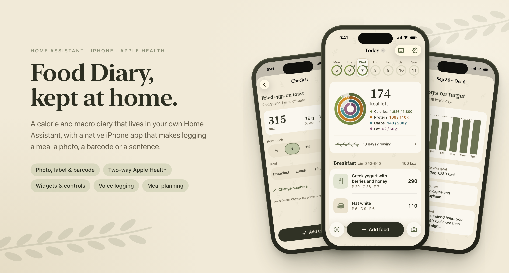
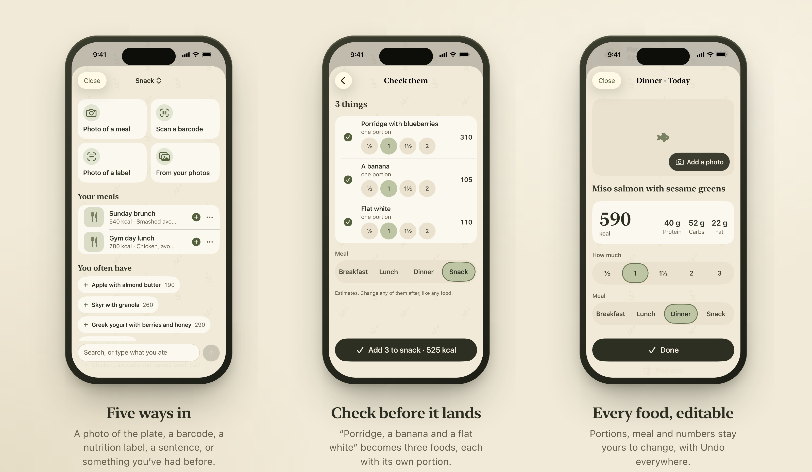
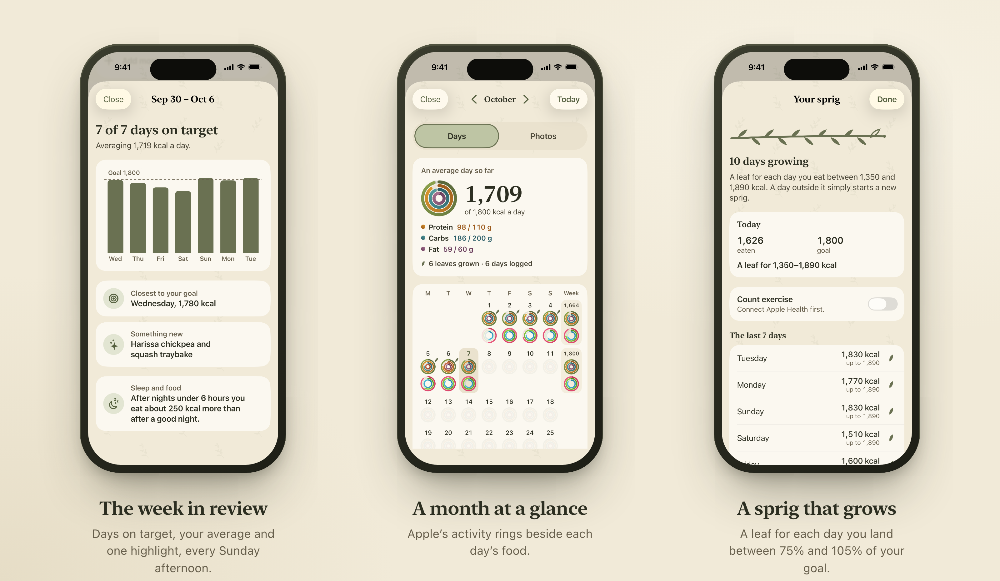
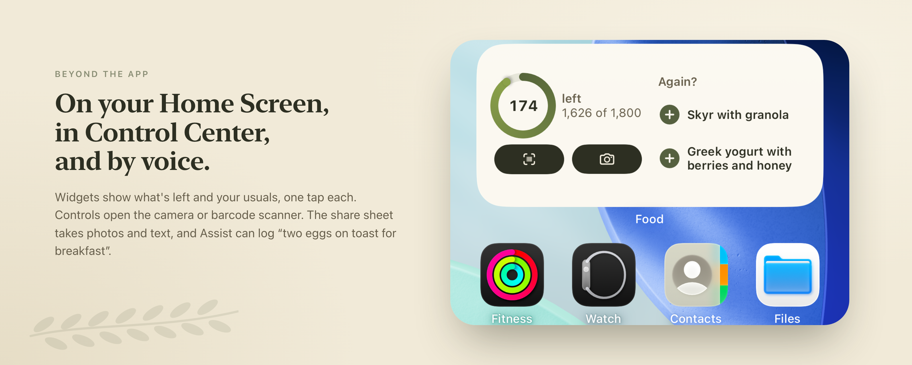
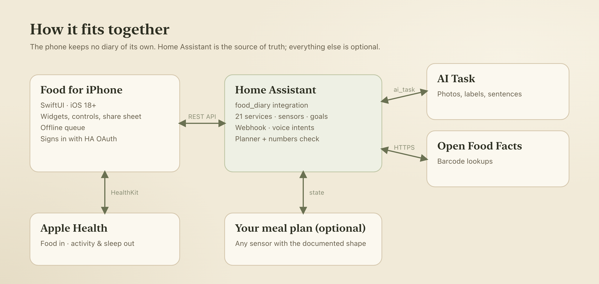

<p align="center">
  
</p>

# Food Diary for Home Assistant

A calorie and macro diary that lives in your own Home Assistant, with a native iPhone app that makes logging a meal a
photo, a barcode or a sentence.

Most food trackers keep your diary on someone else's server. This one stores every food, goal and saved meal in
Home Assistant, with sensors you can chart and automate on. The iPhone app is a fast front end to it, with no account
and no data of its own.

[](https://github.com/HaydenGriffin/ha-food-diary/actions/workflows/tests.yml)
[](https://github.com/HaydenGriffin/ha-food-diary/actions/workflows/validate.yml)
[](https://github.com/HaydenGriffin/ha-food-diary/actions/workflows/ios.yml)
[](https://hacs.xyz/docs/faq/custom_repositories)

## What's in the repo

| Path | What it is |
| --- | --- |
| [`custom_components/food_diary`](custom_components/food_diary) | The Home Assistant integration: the diary, goals, sensors, 21 services, a webhook and voice intents. Installable through HACS. |
| [`ios/`](ios) | **Food**, the SwiftUI iPhone app, with widgets, Control Center controls, a share extension and two-way Apple Health sync. |
| [`custom_sentences/`](custom_sentences) | Optional Assist sentences: "log two eggs on toast for breakfast", "how many calories have I got left?" |
| [`docs/integration.md`](docs/integration.md) | The full reference: options, entities, every service with its fields and responses, and the sensor contracts, and the interface for another integration to provide recipes and a meal plan. |

## The app







The full feature list, build steps and signing notes are in [`ios/README.md`](ios/README.md).

## How it works



- **Home Assistant is the source of truth.** The app calls `food_diary.*` services through the REST API as the
  signed-in user, so each person in the house gets their own diary and their own goals.
- **AI is pluggable.** Photos of meals, nutrition labels and typed descriptions are estimated through Home Assistant's
  [AI Task](https://www.home-assistant.io/integrations/ai_task/) entity, so you choose the model and pay for it
  directly. Barcodes go to [Open Food Facts](https://world.openfoodfacts.org/). Neither is needed to log by hand.
- **Apple Health both ways.** Food is written to Health as food correlations and kept in step with edits and deletes.
  Activity, rings and sleep are read back to sit beside the food.
- **Plans become entries.** If you keep a meal plan in Home Assistant, point the integration at it and planned meals
  appear in the diary as estimates you can confirm or change. A background check flags recipe numbers that look wrong.
- **Works without signal.** Foods with known numbers queue on the phone and go in when Home Assistant is reachable.
- **Retries are safe, newer edits win.** Logging takes an optional `client_id`, so a double tap or a resent request makes
  one entry; entries carry a revision, and background AI work never overwrites a change made while it was thinking
  ([details](docs/integration.md#doing-things-once-and-revisions)).

## Getting started

1. **Install the integration.** In HACS, add `https://github.com/HaydenGriffin/ha-food-diary` as a custom repository
   (category *Integration*), install **Food Diary** and restart. Or copy `custom_components/food_diary` into your
   config folder.
2. **Add a diary.** *Settings → Devices & services → Add integration → Food Diary*, once per person. Setting up an AI
   Task entity first gives you photo, label and text logging.
3. **Build the app** from [`ios/`](ios) with your own Apple developer team, then sign in to your Home Assistant.
4. **Optional:** copy `custom_sentences/en/food_diary.yaml` into your config for voice logging, and connect a meal
   plan sensor ([contract](docs/integration.md#meal-plan-sensor-contract)).

You don't need the app to use the diary: every feature is a service, so dashboards, automations and Assist can drive
it too.

## Development

```bash
# Integration
python -m venv .venv && source .venv/bin/activate
pip install -r requirements_test.txt
pytest

# App (see ios/README.md for signing)
cd ios && cp Config/Local.xcconfig.example Config/Local.xcconfig && xcodegen && open Food.xcodeproj
```

The UI tests run against a mock Home Assistant (`ios/tools/mock_ha.py`) with demo data. The images above are rendered
from those tests' screenshots by [`tools/showcase`](tools/showcase).

## Background

I built this for my own household: a replacement for a subscription food tracker that keeps our data at home and fits
into the rest of our Home Assistant setup. This is the public cut of it, with the house-specific parts removed.

## License

[MIT](LICENSE)
